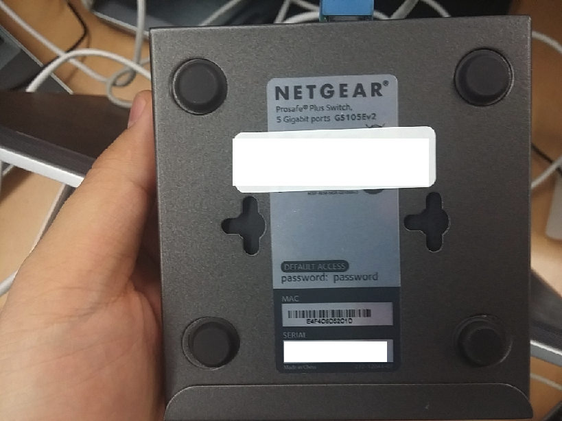
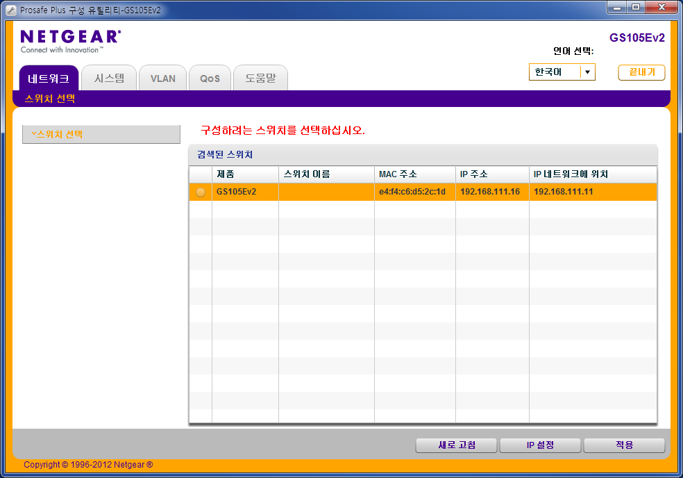
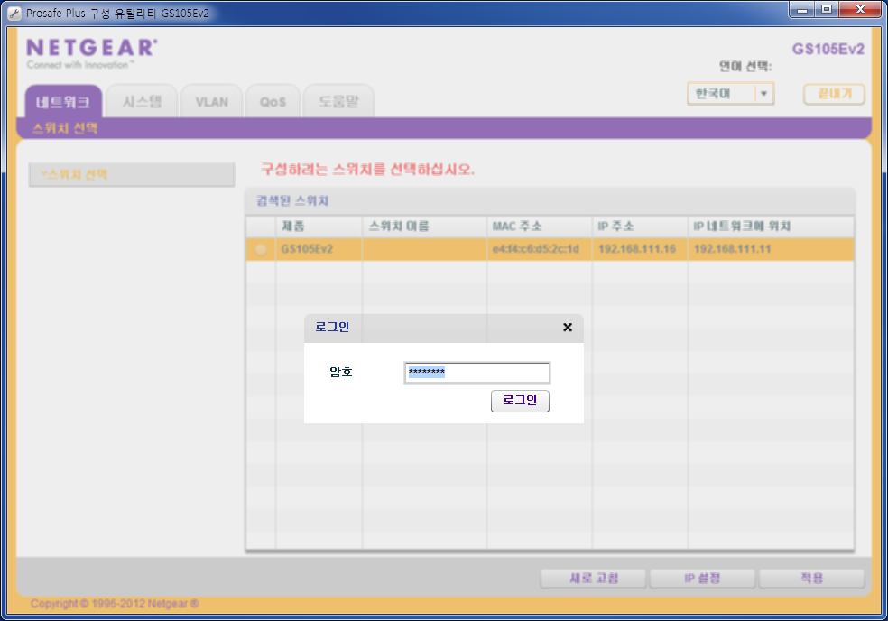
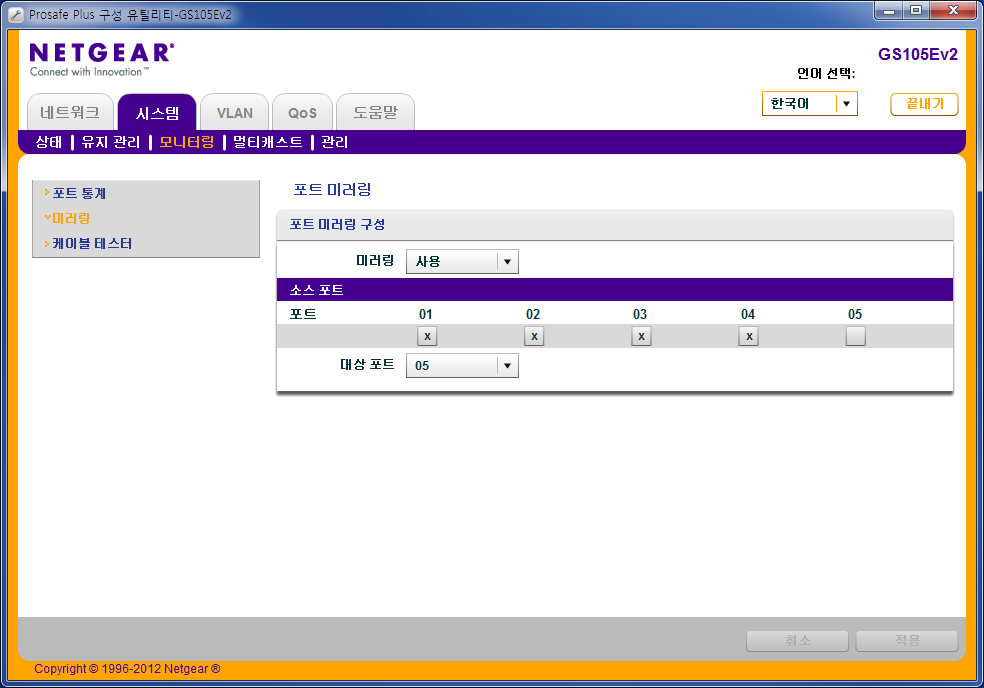

#ngadmin
cli tool to administer the Netgar Prosafe GS105E, GS108E

##How to build

build depeniances:

```
autoconf
automake
libtool
```

required libraries:

```
libreadline-dev
```

install:

```
apt-get install autoconf automake libtool libreadline-dev
```

build:

```
./build.sh
```

or

```
cd ~/ngadmin/
autoreconf -i
./configure --help # see all available options
./configure
make
sudo make install
echo "/usr/local/lib" >> /etc/ld.so.conf.d/01-ngdmin.conf
sudo ldconfig
```

##How to use

use:

```
/usr/local/bin/ngcli -i <interface> -m <MAC> -p <password>
```

example:

check mac address of GS105E




```
$ ngcli -i eth1 -m e4:f4:c6:d5:2c:1d -p password
scan... 
done
login... done
> list
Num Mac                 Product   Name   IP               Ports   Firmware
  0 e4:f4:c6:d5:2c:1d   GS105Ev2         192.168.111.16   5       V1.2.0.5
 
found 1 switch(es)
> tree
<root>
    bitrate
        set
        show
    cabletest
    defaults
    firmware
        show
        upgrade
    help
    igmp
        set
        show
    list
    login
    loop
        disable
        enable
        show
    mirror
        disable
        set
        show
    name
        show
        set
        clear
    netconf
        show
        set
    password
        change
        set
    ports
        state
        statistics
            reset
            show
    qos
        mode
        set
        show
    quit
    restart
    scan
    stormfilter
        enable
        disable
        set
        show
    tree
    vlan
        802.1q
            del
            set
            show
        mode
            set
            show
        port
            set
            show
        pvid
            set
            show
> bitrate show
port 1: in nl, out nl
port 2: in nl, out nl
port 3: in nl, out nl
port 4: in nl, out nl
port 5: in nl, out nl
> firmware show
V1.2.0.5
> ports state 
port 1: down
port 2: 100M full-duplex
port 3: 1000M full-duplex
port 4: down
port 5: 100M full-duplex
> mirror set 5 clone 1
> mirror show
destination: 5
ports: 1 
> mirror set 5 clone 1 2 3 4
> mirror show
destination: 5
ports: 1 2 3 4 
> quit
```

The change, port mirroring setting, can be checked via NetGeat Windows Application.








